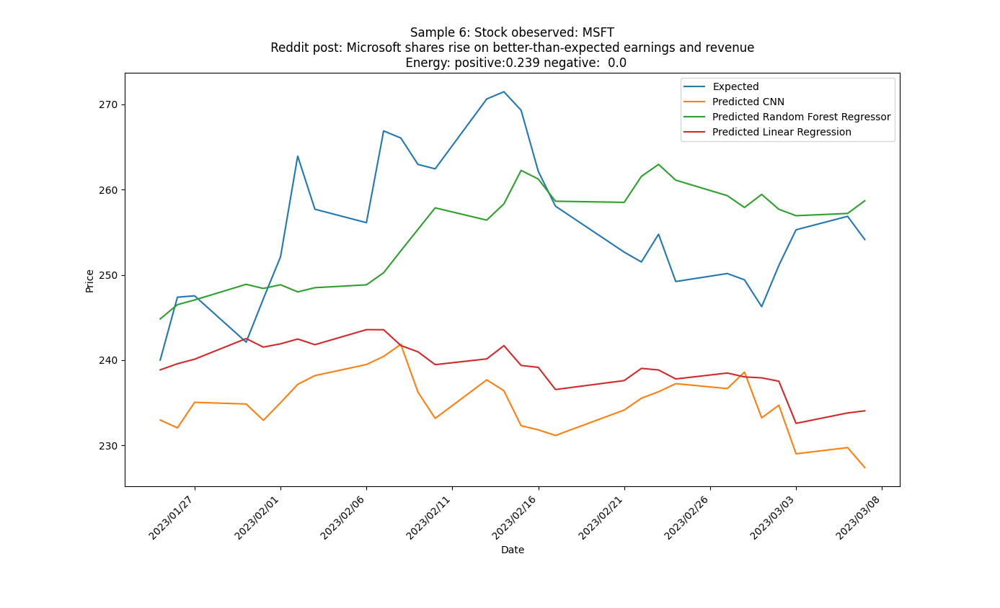
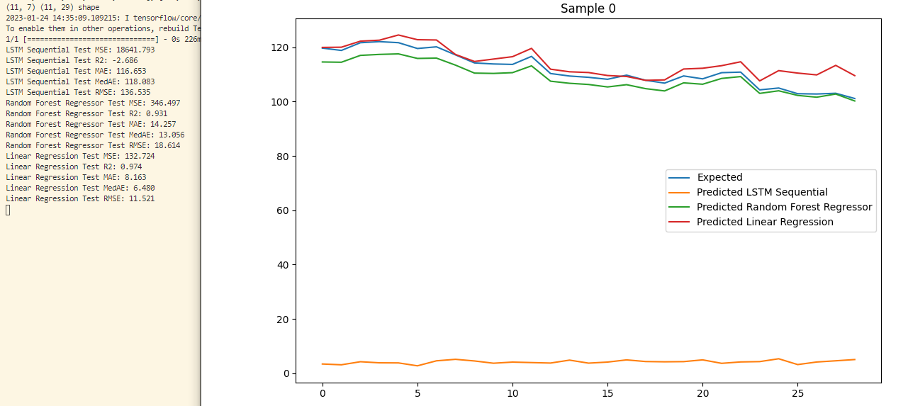

# Stock prediction based on reddit stock mentions at r/Stocks
## Reddit post analysis with nltk SentimentIntensityAnalyzer to map sentence energy.

The ticker value is the closing value of the corresponding stock at the end of each day. The observable time period is adjustable and currently set to 30 days. The point is to see if the interpreted energy of the reddit post (either positive or negative) correlates to the stock value 30 days after the post has beem submitted.

Machine learning algorithms are used to predict test data and are evaluated.
